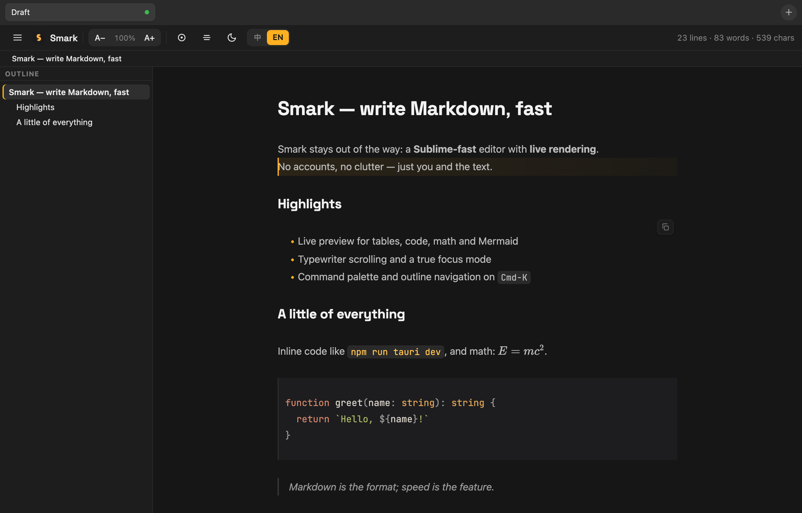
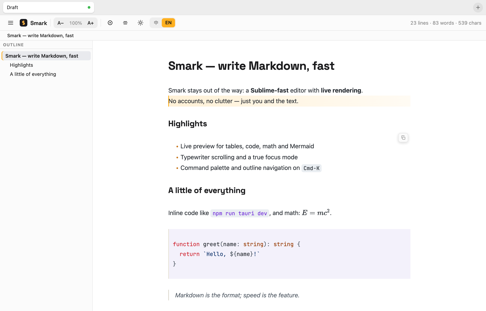

<div align="center">

# Smark

**A fast, beautiful, no-nonsense Markdown editor for your desktop.**

Sublime-fast typing · live rendering · zero clutter · no account required.

[**⬇ Download the latest release**](../../releases/latest)



</div>

---

## Why Smark

Most Markdown apps make you choose: a *fast plain-text editor* with no rendering, or a *pretty rendered app* that feels heavy and locks your notes behind an account. **Smark refuses the trade-off.**

- ⚡ **Fast like a code editor.** A tiny native app — it opens instantly and stays smooth in long documents. A ~6 MB installer, not 150 MB.
- 👁️ **Live rendering, in place.** Headings, **bold**, lists, tables, code blocks, math and diagrams render *as you type* — the line you're editing shows its raw Markdown, everything else stays beautiful. No split preview pane to babysit.
- 🎨 **Designed, not generated.** A warm amber-on-charcoal aesthetic (and a clean light theme) with real typography: Space Grotesk headings, a comfortable reading measure, JetBrains Mono for code.
- 🔒 **Yours, locally.** No login, no accounts, no telemetry. Your files are plain `.md` on disk — open them in anything, anytime. Saves are crash-safe (atomic writes).

## Features

| | |
|---|---|
| **Live preview** | Tables, fenced code (syntax-highlighted), inline & block math (KaTeX), and Mermaid diagrams — rendered inline |
| **Writing modes** | Focus mode (dim inactive lines), typewriter scrolling, current-line highlight |
| **Navigation** | Document outline, heading breadcrumb with sticky-scroll, command palette (`Cmd-K`), jump-to-heading (`#`) |
| **Editing** | Full formatting shortcuts, a Notion-style `/` slash menu, smart link paste, drag-and-drop image import |
| **Tabs & windows** | Multi-tab editing with tear-out windows (drag a tab into its own window) |
| **Themes** | Dark, light, or follow the system appearance — live |
| **Export** | HTML and PDF |

## Screenshots

**Light theme**



## Download

Grab the latest build from the [**Releases**](../../releases/latest) page:

- **macOS (Apple Silicon)** — `Smark_x.y.z_aarch64.dmg`
- **Windows (x64)** — `Smark_x.y.z_x64-setup.exe`

### First launch

Early builds are **not yet code-signed**, so the OS shows a one-time warning.

**macOS** — if you see *"Smark is damaged and can't be opened"*, the file is fine;
macOS just blocks unsigned downloads. Drag Smark into **Applications**, then run
this once in **Terminal**:

```sh
xattr -dr com.apple.quarantine /Applications/Smark.app
```

**Windows** — on the SmartScreen prompt, click **More info → Run anyway**.

## About

This repository hosts the **public builds** and download page for Smark.
Bundled fonts (Space Grotesk and JetBrains Mono) are used under the SIL Open
Font License 1.1.

---

<div align="center">
<sub>© 2026 Smark</sub>
</div>
